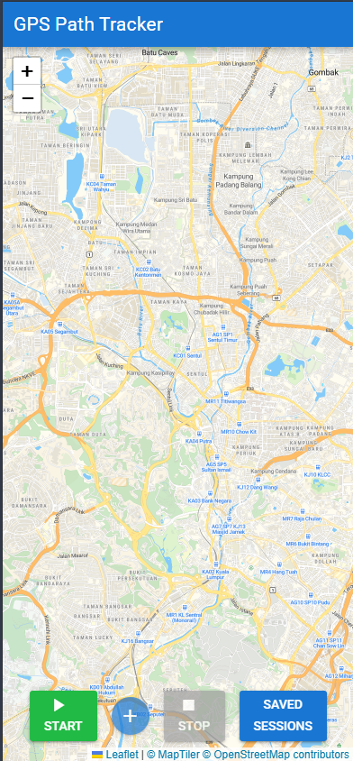
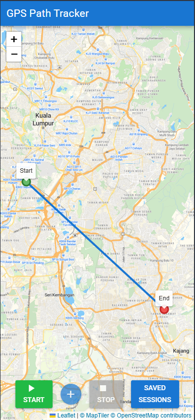
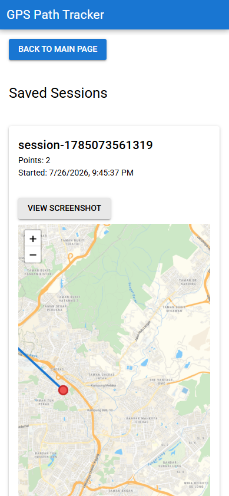

# Task 1 - GPS Tracker (APK)

A simple Vue.js app packaged as an Android APK that records a GPS path on a map, with the ability to drop custom markers and save a snapshot of the path on stop.

## Features

- START: This button starts the path recording. The recorded path will be displayed
  on a map
- STOP: This button stops the path recording and stores an image of the map
  and the path taken on the local device with the start and end markers
- (+) : This button drops a marker on the map and records its location

## Tech Stack

- - Vue.js 3 + **Quasar Framework** -> chosen for its built-in mobile-first UI components
- Capacitor -> for wrapping the web app into an Android APK
- Leaflet -> for map UI

## Project Structure

├── src/
│ ├── components/  
│ ├── utils/  
│ ├── composables/  
│ └── App.vue
├── android/  
├── public/
└── package.json

### APK is in Github Release

## Decisions / Improvements

- Implemented a saved sessions page to allow users to review and monitor previously recorded tracking data
- Refactored key UI components to be more dynamic and data-driven, reducing bug surface area and improving state feedback to the user
- Selected a street-optimized map tile provider to improve visual clarity and overall map readability
- Further UI polish is planned to improve the overall visual design and user experience
- Loading states are planned to provide clearer feedback during data fetches and processing

## Screenshots

 
 

